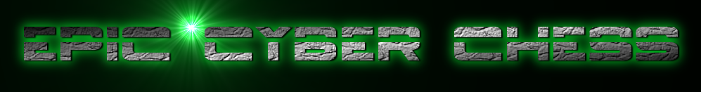
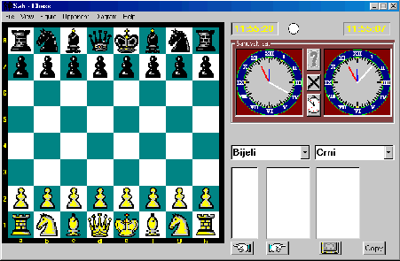
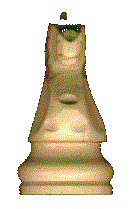

# Tsar-I
Personal attempt at developing a chess engine from the ground up in C++. This attempt will be assisted by the [chess programming wiki](https://www.chessprogramming.org/Main_Page) and its associated forums and resources.

